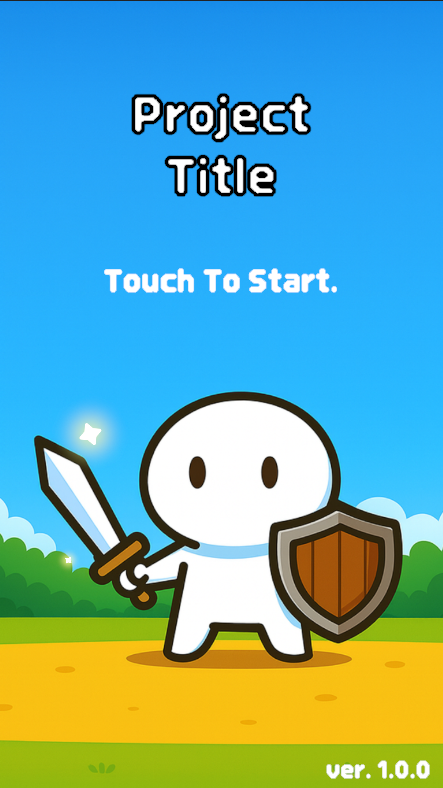
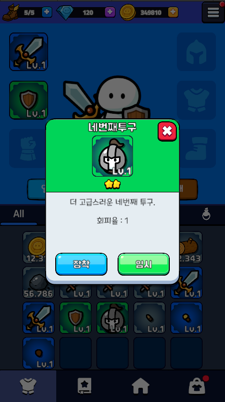
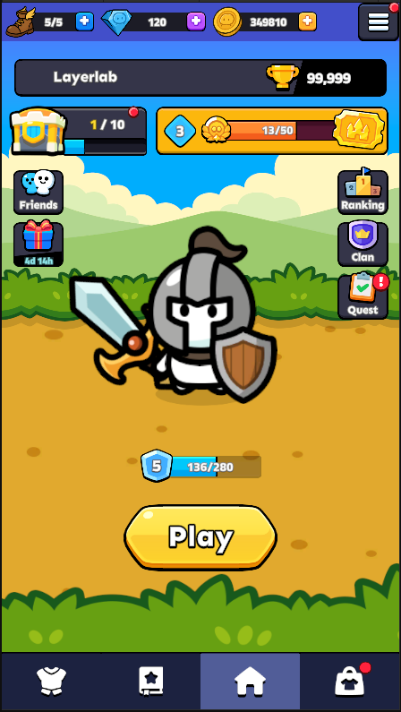
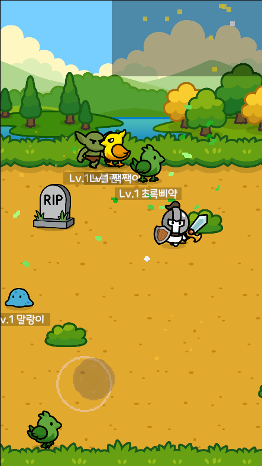
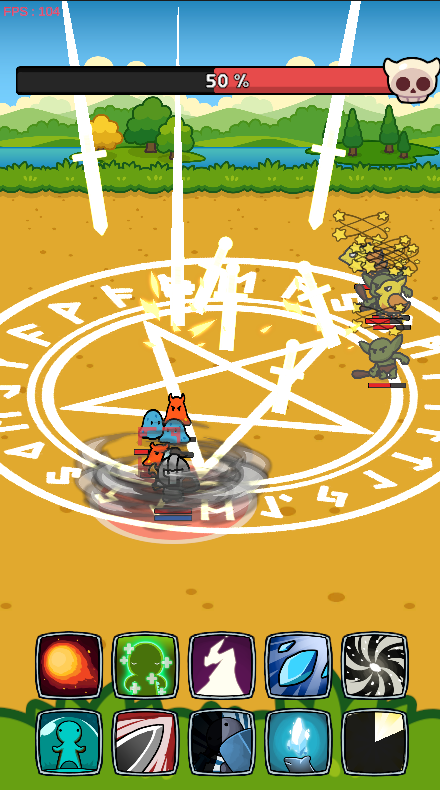
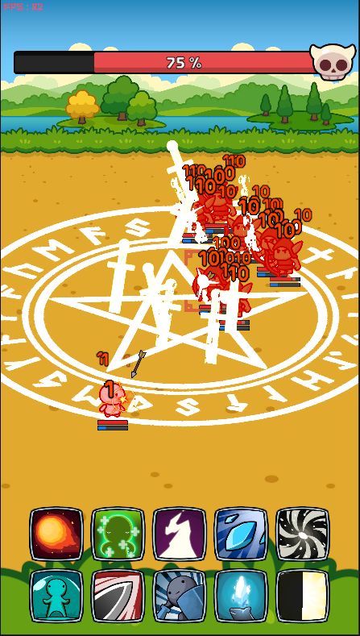
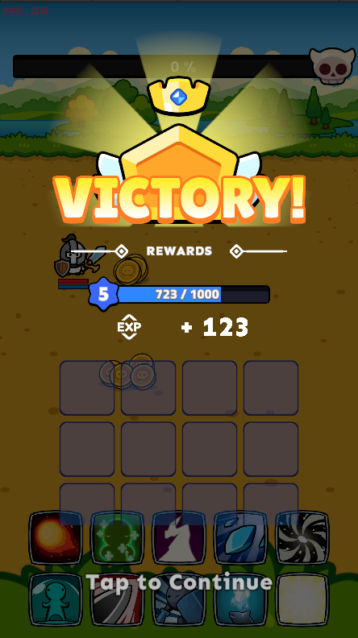

# Project_Code_Share
개인적으로 작업하고 있는 프로젝트들의 공유 리포지토리를 새로 생성하였습니다. 분리하여 공유하는 목적 자체는 원본 리포지토리가 퍼블릭으로 노출됨에 있어서 민감한 리소스, 에셋, 데이터, 코드가 함께 노출될 우려가 있기에 보호를 위함입니다.

## View
- 루트 아래 'ExeShare'폴더에서 빌드된 게임파일을 실행해 보실 수 있습니다.
- 루트 아래 'CodeShare'폴더에서 게임파일과 관련된 코드 스크립트를 확인해 보실 수 있습니다.
- 원본 리포의 작업 내용 일부를 공유하는 리포이기 때문에 상세 설명은 생략됩니다.
- 해당 리포는 앞으로 개발자의 작업물을 지속적으로, 주기적으로 업로드할 예정입니다.

## PreView ScreenShot

  
  
  
  

  
  
  
  

